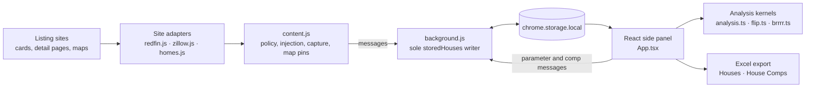
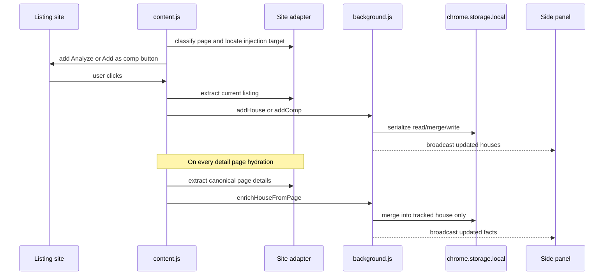

# Investor Sidecar — Architecture

Investor Sidecar is a Manifest V3 Chrome extension for Redfin, Zillow, and Homes.com. It
captures listings and comps from search or detail pages, stores them locally, and renders
buy-and-hold, flip, and BRRRR analysis in the Chrome side panel.

## Runtime pieces

The boundary is deliberate:

- Adapters own selectors and page-specific extraction.
- `content.js` owns shared behavior and listing-action policy.
- `background.js` is the only writer of `storedHouses`.
- The panel owns presentation and global settings.
- Calculation modules are DOM- and Chrome-independent.

## Stored house shape

Each house is keyed by `source:propertyID`, so ids from different platforms cannot collide.
The important groups are:

- Scraped card facts: address, price, beds, baths, square feet, URL, and coordinates.
- `details`: canonical detail-page facts, source tax data, description, and extra label/value
  facts retained for export.
- `localParams`: per-house calculator overrides.
- `comps`: captured rent and sale comparables, including active listings used as sale comps.
- `rev` and `lastWriter`: ordering for user-edit writes.

`globalParams` and the undo log are separate storage keys.

## Capture and enrichment

Detail pages hydrate in stages. `content.js` signs the extracted payload and resends only
when it changes, so late tax-history or facts sections are picked up without creating a
mutation loop. `mergePageDetailsIntoLatest()` accepts page facts only; it never replaces
`localParams`, comps, or revision state.

## Listing-action policy

All card, detail, and map-popup injection paths use the same rules:

| Session | Active sale | Sold | Rental |
| --- | --- | --- | --- |
| Normal | Analyze | — | — |
| Sale comps | Add comp | Add comp | — |
| Rent comps | — | — | Add comp |

Aggregate map markers such as “2 units” are excluded; a marker with one listing amount is
treated as an individual listing.

## Tax precedence

Payment-calculator tax estimates and public annual tax history are stored separately. The
calculation precedence is:

1. Per-house property-tax-rate override.
2. Page-reported annual tax as a fixed dollar amount.
3. Global property-tax-rate fallback.

This prevents a site's financing estimate from silently replacing the public tax record.
The same rule is used by rental, flip, and BRRRR calculations and by the Excel formulas.

## Excel export

`export.ts` builds exactly two tabular models:

- `Houses`: one row per subject property, including enriched facts, assumptions, tax data,
  formula-driven analysis, and rent/sale comp summaries.
- `House Comps`: one row per subject/comp relationship, with formulas that look the subject
  up on `Houses` and calculate amount, percentage, size, bed, and bath deltas.

Inputs are ordinary numeric cells. Derived outputs are Excel formulas, so changing an
assumption in the workbook recalculates dependent values. URLs are exported as hyperlinks.

## Build and testing

Vite bundles the side panel. Files under `public/` are copied into `dist/` unchanged, so
the shipped adapters and driver are the same files exercised by the jsdom adapter tests.
After `npm run build`, reload the unpacked extension and refresh existing listing tabs;
`#calculator-styles[data-sidecar-build]` identifies the content-script build loaded in a tab.
