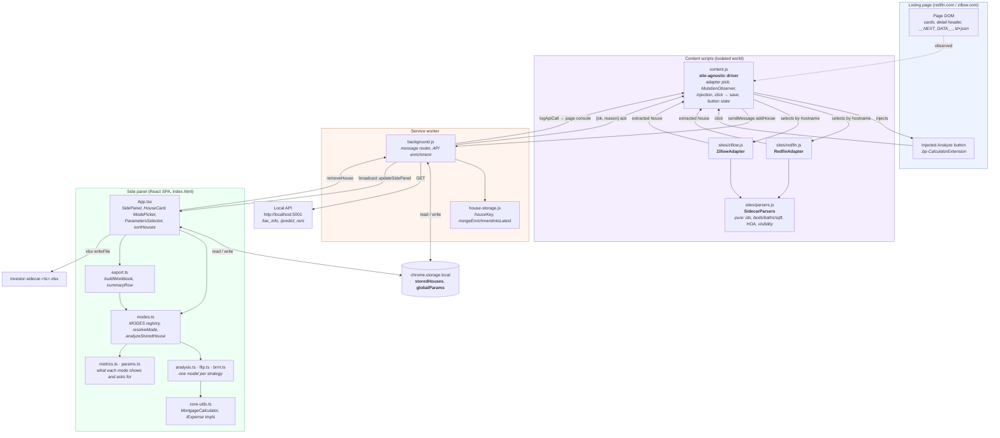
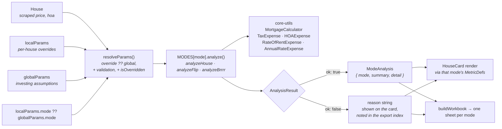
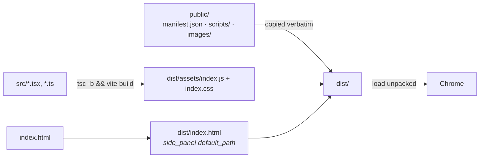

# Investor Sidecar — Architecture

A Manifest V3 Chrome extension that injects an "Analyze" button into Redfin and
Zillow listings, captures the property, enriches it with tax/rent estimates from a
local API, and renders cashflow analysis in a side panel.

## Components



## Capture flow

```mermaid
sequenceDiagram
    participant U as User
    participant C as content.js
    participant A as Site adapter
    participant B as background.js
    participant S as chrome.storage.local
    participant API as Local API
    participant P as Side panel

    Note over C: MutationObserver (debounced 150ms,<br/>run in requestIdleCallback,<br/>detached during resize)
    C->>A: isDetailPage() / findCardElements()
    C->>A: cardInjectionTarget() / detailInjectionTarget()
    C->>C: inject button (one per card; exactly one on detail pages)

    U->>C: click Analyze
    C->>C: state = "working"
    C->>A: extractFromCard() / extractFromDetailPage()
    A-->>C: house { source, address, price, beds, baths,<br/>sqft, propertyID, url, lat/long, hoa }
    C->>C: reject non-numeric propertyID
    C->>B: sendMessage { action: addHouse, house }

    B->>S: get storedHouses
    alt not already tracked (by houseKey)
        B->>S: set storedHouses + [house]
        B-)P: updateSidePanel { houses }
    end
    B-->>C: { ok: true, added }
    C->>C: state = "saved" (flash "Added")

    Note over B,API: Enrichment continues after the ack —<br/>an unavailable API never delays the save
    par background enrichment
        B->>API: GET /tax_info?zip_code=…
        B->>API: GET /predict_rent?sqft,beds,baths,price,state,lat,long
    end
    API-->>B: tax_rate / rent percentiles
    B-)C: logApiCall (relayed to the page console)
    B->>S: re-read storedHouses (may have changed)
    B->>B: mergeEnrichmentIntoLatest()<br/><i>API fields only; never clobber user edits</i>
    B->>S: set storedHouses
    B-)P: updateSidePanel { houses }
    P->>P: re-render cards
```

## Analysis pipeline

The panel and the Excel export share one calculation path, so a spreadsheet can
never disagree with what's on screen. That path runs through the mode a house is
stored under — see [calculator-modes.md](./calculator-modes.md).



## Data model

Stored under two `chrome.storage.local` keys:

| Key | Shape | Written by |
| --- | --- | --- |
| `storedHouses` | `House[]` — scraped facts + `rentEstimate`/`apiTaxRate` (API) + `localParams` (user) + `rev`/`lastWriter` | background.js only |
| `globalParams` | `GlobalParameters` — financing, operating, flip/BRRRR assumptions, per-mode card metrics, default strategy, theme | App.tsx only |
| `undoLog` | inverse entries, capped at 20 — see [calculator-modes.md](./calculator-modes.md) §4 | background.js only |

`localParams` is keyed by the param registry (`src/params.ts`), so a new mode's
fields need no change to the stored shape. `rev` and `lastWriter` let a mounted
card tell a write it made itself — which it must ignore, having newer keystrokes
in hand — from one it didn't, which it must adopt.

Identity is `houseKey(house) = "<source>:<propertyID>"`, defined twice on purpose —
`house-storage.js` for the worker, `App.tsx` for the panel — because both sites use
bare digits and a zpid could otherwise collide with a Redfin id.

The service worker is the sole writer of `storedHouses`; the panel sends messages
rather than writing. Every mutation goes through `mutateStoredHouses`, which is
what makes a read and its write atomic with respect to each other — and therefore
the only place that can record an undo entry against the array it is about to
overwrite. `mergeEnrichmentIntoLatest()` re-reads storage and applies only the
API-owned fields, returning `null` if the house was deleted mid-flight.

Card edits are coalesced (400 ms debounce, flushed on blur) rather than sent per
keystroke, which is also what keeps one edit worth one undo entry.

## Adapter contract

`content.js` references no site-specific markup. Each adapter in `scripts/sites/`
implements:

```
matchesHost(hostname)        isDetailPage()
findCardElements()           isInjectableCard(el)      cardInjectionTarget(el)
extractFromCard(el)          extractFromDetailPage()
detailInjectionTarget()      extraInjectionTargets()   diagnostics()
cardButtonClassName · detailButtonClassName · detailWrapperClassName
```

`extraInjectionTargets()` covers surfaces that aren't cards — Redfin's table-view
action bar is the current user. Adding a third site means adding one file and one
entry in `ADAPTERS`, plus its manifest match patterns.

Notable per-site differences the parsers absorb: Redfin's id is a trailing
all-digits path segment, Zillow's is `<digits>_zpid`; Zillow's class names are
hashed styled-components output so nothing keys off them; Zillow's geo comes from
`__NEXT_DATA__` (scoped to the current zpid) and its price from `ld+json`, while
Redfin gets both from `ld+json`.

## Build and load



`public/scripts/` is plain JS, shipped unbundled — the content scripts load in
manifest order (`parsers → redfin → zillow → content`) and communicate through
globals rather than ES modules; `background.js` is a module worker and does use
`import`. Tests (`vitest`, jsdom) load `parsers.js` directly in a vm sandbox so
they exercise the shipped file rather than a copy.

## Boundaries worth knowing

- **Rent/tax enrichment depends on a local service** at `localhost:5001`; every
  failure path returns a `taxError`/`rentError` string that surfaces on the card
  rather than throwing.
- **Both sites are SPAs.** Navigation is caught via DOM mutations plus `popstate`;
  stale cards from the previous view are swept once per URL so a leftover button
  can't capture the wrong property.
- **The observer is a guest on someone else's page.** It ignores mutation batches
  describing only our own nodes (`data-sidecar="1"`), and fully disconnects for the
  duration of a window resize.
- **OAuth code in `background.js` is legacy** — the login/logout message handlers
  are not reachable from the current UI.
