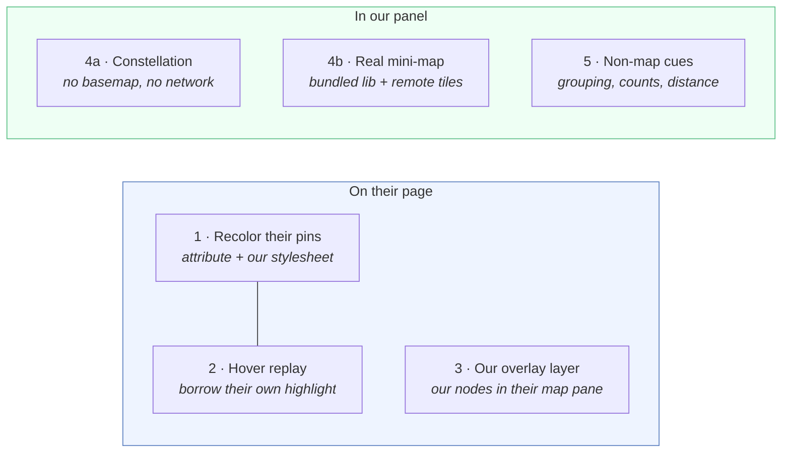

# Relating the side panel to the map — feasibility + plan

_Measured live on 2026-07-29 against Redfin (`/city/30818/TX/Austin`) and Zillow
(`/austin-tx/`). Every number below is from an actual probe in a real browser, not an
estimate. Interview driver: "he needs a way to see the houses he has selected on the map."_

## The problem, restated

Pulling rent comps and for-sale comps is a spatial task done in a non-spatial UI. The user
captures eight or twelve listings into the panel, and by the fourth one the addresses have
stopped meaning anything. Two different needs hide inside "show them on the map":

1. **Locate** — *where are my saved houses?* A glance answer, for all of them at once.
   This is what tells him his "comps" are actually three different submarkets.
2. **Link** — *which card is which pin?* A correspondence, in both directions, one house
   at a time.

They have different best answers, and (2) turns out to be much cheaper than expected.

Companion doc: [comp-workflow.md](./comp-workflow.md), from the same interview, covers
capturing comps. Its §5 originally deferred the map pin on the belief that both maps are
canvas/WebGL; that premise is disproven below and the section has been corrected.

## Headline finding

**Both sites render their map pins as ordinary DOM, with stable, semantic class names, and
both can be linked to our panel exactly — Redfin trivially, Zillow via a two-event
calibration that measured at 0.00 px error.** Highlighting a saved house's pin costs one
`<style>` element (we already inject one) and one attribute per matching pin. No wrapper
nodes, no class rewriting, no network calls, no page-world injection.

The real blocker is not the DOM. It is that **Zillow card captures store no coordinates
at all** — `latitude: null, longitude: null`, hardcoded. That has to be fixed first, and
the fix is ~15 lines that also unblocks rent enrichment.

---

## 1. What I measured

### 1.1 Redfin

| Question | Finding |
|---|---|
| Are pins DOM? | Yes. `.HomeMarkersContainer > div.Pushpin`, **330** on the Austin city page. Zero canvas-rendered markers. |
| Do pins carry identity? | **Yes — `latitude` and `longitude` attributes on every one of the 330.** Also `data-rf-test-id="home-marker-<n>"`, but `<n>` is a render index, not a property id. |
| Class vocabulary | `Pushpin homePushpin dotPin\|priceMapPin clickableHome brokerage isMapPinPreview`. Inner: `.bp-PushpinContent > .inner-pushpin-content > .price`. Unhashed and descriptive. |
| Does Redfin already have a "selected" state? | Yes — it toggles a `selected` class on the pin itself. |
| Can we recolor a specific pin? | **Verified.** One injected `<style>` + `data-sidecar-pin="1"` on 4 matched pins → they render green. Screenshot-confirmed. |
| Does the highlight survive a pan? | **Yes.** After dragging the map: 330 pins, 4 still tagged, and `isConnected` true on the *same 4 nodes* — Redfin reuses pin elements rather than recreating them. |
| Card → pin sync | Native, and replayable. Dispatching synthetic `mouseover`/`mouseenter` on a `.bp-Homecard` moved Redfin's own `selected` class to the correct pin. |
| Pin → panel | A passive capture-phase listener on `document` sees `mouseover`/`click` on `.Pushpin[latitude]` and reads the coordinates straight off the target. No navigation was triggered, no mutation needed. |

Identity on Redfin is a **direct coordinate join**. Matching 4 known houses against the
330 pins gave a coordinate delta of exactly `0`.

### 1.2 Zillow

| Question | Finding |
|---|---|
| Are pins DOM? | Yes. `[data-test="property-marker"]`, **265** of them, inside `.zillow-map-layer > .BulkPropertyMapMarker`. No canvas. |
| Class vocabulary | `streamlined-marker-container`, `property-dot`, `dot-color-forsale`, `property-pill`, `pill-color-forsale`, `is-hovered`. **Semantic and unhashed** — a notable exception to the hashed styled-components names recorded in `zillow-recon.md`. Worth adding there. |
| Do pins carry identity? | **No.** Attributes are `class`, `data-test`, `style` only. No zpid, no coordinates. `style` holds a `transform` and a `z-index`. |
| Is there a coordinate source for listings? | **Yes.** `__NEXT_DATA__.props.pageProps.searchPageState.cat1.searchResults.listResults` — 41 records carrying `zpid`, `latLong`, `unformattedPrice`, `beds`, `baths`, `area`, `addressStreet/City/State/Zipcode`. (`mapResults` exists but was **empty**, so it gives nothing for the other 224 pins.) |
| Can we recolor a specific pin? | **Verified.** `<style>` + `data-sidecar-pin="1"` on 3 matched markers → green pins, screenshot-confirmed. |
| Survives zoom and pan? | **Yes.** After a zoom-in and a drag: 265 → 264 markers, all 3 tags intact and correctly repositioned. |
| Card → pin sync | Native and replayable, same as Redfin: synthetic `mouseover` on an `article[id^="zpid_"]` makes Zillow add `is-hovered` to the matching marker and raise its `z-index`. |

#### Solving Zillow marker identity

Three approaches tested. Markers have no id, so identity has to come from geometry.

| Method | Result |
|---|---|
| **A. URL `searchQueryState.mapBounds` + `.gm-style` rect** | **41/41 matched, median error 0.2 px, max 0.2 px.** Exact — but the URL carries no `searchQueryState` until the user pans or zooms, so it is unavailable on a cold page load. |
| **B. `__NEXT_DATA__.queryState.mapBounds`** (the cold-load fallback) | **Fails: 17/25, worst error 23.8 px.** Those are the *requested* region bounds; Google Maps fits the region to the container's aspect ratio and adds padding, so the rendered viewport is not what the payload says. Do not use. |
| **C. Hover-probe calibration** ← recommended | Dispatch synthetic `mouseover` on two rendered result cards, read which marker gains `.is-hovered`, and fit an affine Web-Mercator map from the two resulting *(lat/lon, screen px)* pairs. On a **cold load with no URL state: 41/41 matched, median / p90 / worst error all 0.00 px**, and the implied zoom came out to exactly `10.000`. |

The implied zoom landing on a clean integer is the tell that the model is right, and it
also means the *scale* can be recovered analytically (`256 · 2^zoom / 360` px per degree
of longitude), so a single probe plus an integer-snap is enough — the second probe is
cheap redundancy that also validates the fit.

Validated projection, for reference:

```js
const mercY = lat => Math.log(Math.tan(Math.PI / 4 + lat * Math.PI / 360));
// A and B: two probed markers with known lat/lon and measured screen centres
const kx = (A.px.x - B.px.x) / (A.lon - B.lon);
const ky = (A.px.y - B.px.y) / (mercY(A.lat) - mercY(B.lat));
const project = (lat, lon) => ({
  x: A.px.x + (lon - A.lon) * kx,
  y: A.px.y + (mercY(lat) - mercY(A.lat)) * ky
});
```

Match a saved house to a pin by nearest projected centre with a tolerance of a few pixels;
reject anything beyond it rather than guessing. On Redfin, skip all of this and join on the
`latitude`/`longitude` attributes.

---

## 2. The prerequisite that gates everything

Nothing here works for a house whose coordinates we never stored.

| Capture path | Has lat/long today? | Source |
|---|---|---|
| Redfin detail page | ✅ | scoped `ld+json` `geo` |
| Redfin results card | ✅ | per-card `ld+json` — present on **41 of 43** cards measured |
| Zillow detail page | ✅ | scoped `__NEXT_DATA__` walk |
| **Zillow results card** | ❌ **hardcoded `null`** | `zillow.js` `extractFromCard()` comments it as unavailable |
| Houses saved before this change | ❌ | never captured |

Three items fall out, and the first is required before any option below is worth building:

- **P0 — Zillow card geo.** `extractFromCard()` can look the zpid up in
  `listResults` and read `latLong` directly. Roughly 15 lines in `zillow.js`. This is
  independently valuable: it is the exact blocker `feature-research.md` §B7 calls
  "blocked at step zero", because Zillow captures currently get no rent estimate at all.
- **P1 — the type lies.** `House.latitude` and `.longitude` are declared
  `number` (non-optional) in `src/App.tsx:43-44`, but the card path writes `null`.
  Tighten to `number | null` before any code starts trusting them.
- **P2 — legacy records.** Existing saved houses have no coordinates. Either backfill on
  next visit to the listing, or render them in a distinct "location unknown" state. Do
  not silently drop them from the map.

---

## 3. Options



### Option 1 — Recolor their pins  ★ recommended core

Tag every pin that matches a saved house with `data-sidecar-pin="1"`; one injected
stylesheet does the rest. Answers **Locate** directly on the map the user is already
looking at, with no new surface to learn.

- **Delivers:** all saved houses visible in place, at a glance, in their real spatial context.
- **Cost:** small. Redfin is a coordinate join; Zillow needs the calibration above.
- **Footprint:** one attribute per matching pin. Verified to survive pan and zoom on both sites.
- **Fails when:** the property has no pin in the current result set (see §5), or a selector drifts.

### Option 2 — Hover replay  ★ recommended companion

For the **Link** need. Hovering a card in our panel sends a message to the content script,
which dispatches a synthetic `mouseover` on the site's own results card — and the site
lights up its own pin, in its own visual language. The reverse direction is a single
passive capture-phase listener: hovering a pin tells the panel which card to highlight.

- **Delivers:** unambiguous card↔pin correspondence, one house at a time.
- **Cost:** small — but needs the first real content-script message listener. Note
  `background.js:169` already sends `houseRemoved` to the content script and **nothing
  listens for it**; that dead path is where this wiring should land.
- **Footprint:** zero DOM mutation. We replay a hover the user could have performed.
- **Fails when:** the site's card isn't rendered (Zillow virtualizes its list — only ~9
  cards in the DOM at a time). Fall back to Option 1's own highlight, which needs no card.

### Option 3 — Our own pin in their map  ★ validated live, upgraded

Append our own marker node into the site's marker container, positioned by our own
projection. **Built and tested end-to-end on both sites (2026-07-29, follow-up session):**
a purple pin injected at an arbitrary coordinate with no listing rendered correctly on both
maps, survived drag and zoom, and — with the correction loop below — measured **0 px
geographic drift** after every map move.

What the test established:

- **Redfin positions pins with `position:absolute; left/top`** inside
  `.HomeMarkersContainer`, and because every Redfin pin carries `latitude`/`longitude`
  attributes *and* its `left/top`, the projection can be fitted from any two on-screen
  pins with **no hover probes at all** — the fit reproduced all 330 pin positions to
  within 0.001 px. Zillow markers position with `transform: translateX/Y` in
  `.BulkPropertyMapMarker`; same math, anchored on the two hover-probe markers.
- **The one real mechanic: both sites rebase the pane's coordinate space after a map
  move.** Their own pins get fresh positions; an injected node keeps its stale ones and
  lands wrong by exactly the pan delta (measured: 640 px after one drag). The fix is
  mechanical — a MutationObserver on the marker container watching the *site's* pins'
  style changes, re-fit, re-place (debounced 80 ms). With it armed: 0 px drift after
  drag on both sites, 0 px after zoom on Redfin.
- **Injected nodes are not wiped**: both sites reuse marker nodes rather than re-rendering
  the container, so the pin survived every drag/zoom tested. A container teardown (heavy
  filter change, list refresh) would remove it; the same observer sees that and re-inserts.
- On Zillow the two anchor markers can leave the viewport and die; recalibration then
  falls back to the URL `searchQueryState.mapBounds` fit — which is always present after
  the user has moved the map, exactly when anchors go stale — or fresh hover probes.

Where this leaves it:

- **Delivers:** the coverage recoloring can't — a saved house with *no pin in the current
  result set* (the §5 pin-cap gap: 330 pins for 5,982 homes) still shows on the map, plus
  full control of the mark (badge, cashflow colour, count).
- **Cost:** medium — the projection Option 1's Zillow path already needs, plus the
  reposition loop. Redfin's half is strictly easier than expected (no probes).
- **Footprint:** one node per saved house in their marker container, repositioned once per
  map move (their own pins mutate hundreds of styles per move; our writes are noise on
  top of that). Nodes carry `data-sidecar` so our content-script observer ignores them.
- **Verdict, revised:** no longer "not worth it" — it is the answer to the pin-cap
  problem, which is Option 1's biggest hole. Recommended shape: **Option 1 recolors the
  pins that exist; Option 3 adds our pin only for saved houses that have none.** One
  visual language ("your houses are purple"), no double-marking, and the "N of M" chip
  (Option 5) becomes "and the rest are purple pins" instead of an apology. Ship it as
  Phase 2.5, after the projection machinery exists.
- **Remaining caveats:** an off-viewport saved house still shows nothing (nothing to
  anchor to — the constellation view still owns that case); zoom-during-animation was
  only spot-checked on Redfin; and an injected pin is the one part of this plan that
  adds *our* content to *their* map, so it must visually read as ours (distinct shape,
  our purple) and never occlude their pills.

### Option 4a — Constellation view in the panel

A small canvas at the top of the panel plotting saved houses by relative lat/long, no
basemap, no tiles, no network. Dots positioned by Mercator, a scale bar for distance, dot
colour by cashflow, click to scroll to the card.

- **Delivers:** the **Locate** answer *everywhere* — on detail pages, on a page for a
  different city, with the map hidden, and for houses that have no pin. Complements
  Option 1 rather than competing with it.
- **Cost:** small-to-medium. ~150 lines, no dependency.
- **Footprint:** zero. It never touches their page.
- **Trade-off:** no streets, so it reads as "three clusters, six miles apart" rather than
  "this one is on the wrong side of the highway". For the interview complaint — *comps
  that aren't really comparable* — that is often exactly enough.

### Option 4b — Real mini-map with tiles

Leaflet or MapLibre bundled into the panel, with OSM / Carto / Protomaps tiles.

- **Delivers:** the full thing, ours to design.
- **Cost:** high by this codebase's standards. A map library is a large fraction of the
  panel's current bundle, and `recharts` is already lazy-loaded specifically to keep the
  initial bundle down.
- **Real blockers:** it introduces a **third-party network dependency and a new class of
  data leaving the machine** (every tile request tells the tile host roughly where the
  user is house-hunting). That contradicts the posture of `PRIVACY.md` and would need a
  store-listing and privacy-policy update. Tile providers also impose usage policies.
  MV3's default CSP permits remote *images*, so it would technically work — but this is a
  product/privacy decision, not a technical one.
- **Verdict:** defer. Build 4a first and see whether streets are actually missed.

### Option 5 — Non-map spatial cues

Cheapest of all, and genuinely useful alongside the others: group panel cards by
cluster/ZIP with a header, show a "**7 of your 12 saved houses are on this map**" chip,
show each card's distance from the currently-viewed listing, and flag when saved "comps"
span more than N miles.

- **Delivers:** most of the *judgement* the map was going to provide, with no map.
- **Cost:** small.
- **Verdict:** worth doing regardless. The "N of M on this map" chip is the honest answer
  to the pin-cap problem in §5, and it's needed whichever option ships.

---

## 4. Recommended plan

**Phase 0 — coordinates (blocking, small).**
Zillow card geo from `listResults`; loosen the `House` lat/long types; decide the legacy
backfill story. Also worth landing on its own merit: this unblocks Zillow rent estimates.

**Phase 1 — Redfin, both directions (small).**
Redfin needs no projection at all, so it proves the whole interaction model cheaply:
coordinate-join tagging + our stylesheet, panel-hover → card-hover replay, pin-hover →
panel highlight. Ship Option 5's "N of M on this map" chip with it, because the pin-cap
gap shows up immediately.

**Phase 2 — Zillow (medium).**
Hover-probe calibration, cached and recomputed only when the marker set or bounds change,
with the URL `mapBounds` path as a cheap fast path once the user has panned. Same tagging
and same messaging as Phase 1 — only the identity resolver differs, which is exactly the
split the existing adapter contract already expects.

**Phase 3 — constellation view (medium).**
Option 4a in the panel, covering every case Phases 1–2 structurally cannot.

**Deferred:** Option 3 (overlay layer) and Option 4b (tiled map). Both are re-openable if
the constellation view proves too thin, and neither is blocked by anything above.

### Where the code goes

The adapter contract in `docs/architecture.md` already has the right shape for this. Add
to each site adapter:

```
findMapPins()            → the pin elements, or [] if this page has no map
pinCoordinates(pin)      → { latitude, longitude } | null   (Redfin: attributes;
                                                             Zillow: via calibration)
resultCardFor(house)     → the site's own card element, for hover replay
mapDiagnostics()         → pin count, calibration status, match count
```

`content.js` stays site-agnostic: it reconciles "saved houses" against "pins" and owns the
stylesheet, the messaging, and the observer discipline — no Redfin or Zillow markup, same
as today.

---

## 5. Risks and limits

- **Pin caps are real and will be noticed.** Redfin rendered **330 pins for 5,982 homes**;
  Zillow rendered **265 markers for 306 results**. A saved house often has *no pin on the
  current map* — it is filtered out, off-viewport, or past the cap. This is not a bug we
  can fix, so it needs an explicit affordance (Option 5's chip) rather than silence.
  Getting this wrong is worse than shipping nothing: a user who trusts the highlight will
  conclude a house isn't in the area when it is.
- **Selector drift.** `[data-test="property-marker"]`, `.HomeMarkersContainer`, and the
  `is-hovered` class are all undocumented. Each needs a diagnostics entry (extend
  `diagnostics()`, which already exists on both adapters) and must **no-op silently** —
  a broken highlight must never break capture, which is the feature that actually matters.
- **`__NEXT_DATA__` is an SSR snapshot.** It does not update on client-side pan or filter.
  Fine as a capture-time geo source; never use it as a live lookup at highlight time.
- **Zillow list virtualization** (~9 cards in the DOM) limits hover replay and constrains
  calibration to rendered cards. If none are rendered, fall back to URL bounds; if those
  are absent too, skip highlighting rather than mis-highlighting.
- **Reconcile cost.** Matching against 265–330 pins means a batched read of that many
  element rects. Piggyback the existing debounced + `requestIdleCallback` observer in
  `content.js`, keep reads and writes in separate passes so layout flushes once, and
  inherit the existing "fully disconnect during resize" rule.
- **Bot protection.** Everything measured here is local DOM reads plus synthetic events on
  the page the user already loaded — no calls to Zillow's own endpoints, no page-world
  injection, no React-internals access. The hover probes are the only simulated activity;
  cap them at two per calibration and debounce recalibration.

## 6. Not yet checked

- **Rental search pages** (`/rentals`, Redfin's rent tab). Rent comps are half of the
  workflow the interview was about, and the marker markup may differ. **Check this before
  committing to Phase 1 scope** — it is the most likely place the plan needs widening.
- Redfin's table/list layout with the map hidden, and Redfin's "Draw" search mode.
- Zillow at high zoom, where markers switch between `property-dot` and
  `property-pill-geo-anchor` — the recolor CSS covers both classes, but relative visual
  weight was only eyeballed at one zoom level.
- Satellite view, drawn-boundary searches, and the commute-time overlay on either site.
- Whether Zillow's `is-hovered` behaviour holds on the showcase template.
- Extension CSP against a live remote tile host — only matters if Option 4b is revived.
